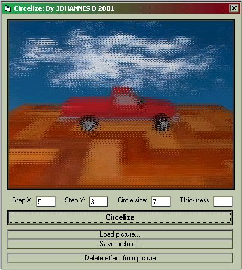



## Image effect: Circelize

### Description

This is a image effect that looks very cool on many pictures! Very short and easy to understand code! Please vote!
 
### More Info
 

             |
---                |---
**Submitted On**   |2001-08-10 20:04:12
**By**             |[Johannes B](https://github.com/Planet-Source-Code/PSCIndex/blob/master/ByAuthor/johannes-b.md)
**Level**          |Beginner
**User Rating**    |4.7 (14 globes from 3 users)
**Compatibility**  |VB 5\.0, VB 6\.0
**Category**       |[Graphics](https://github.com/Planet-Source-Code/PSCIndex/blob/master/ByCategory/graphics__1-46.md)
**World**          |[Visual Basic](https://github.com/Planet-Source-Code/PSCIndex/blob/master/ByWorld/visual-basic.md)
**Archive File**   |[Image effe244028102001\.zip](https://github.com/Planet-Source-Code/johannes-b-image-effect-circelize__1-26062/archive/master.zip)

